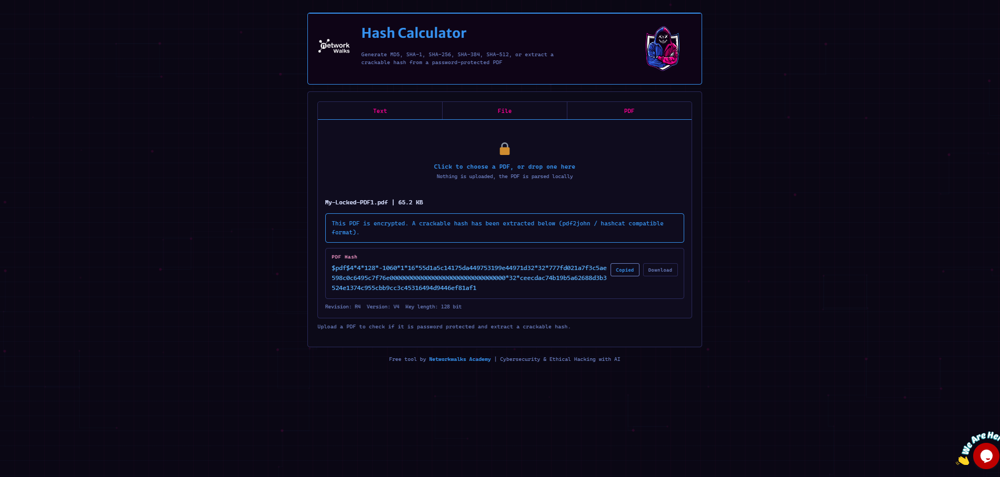
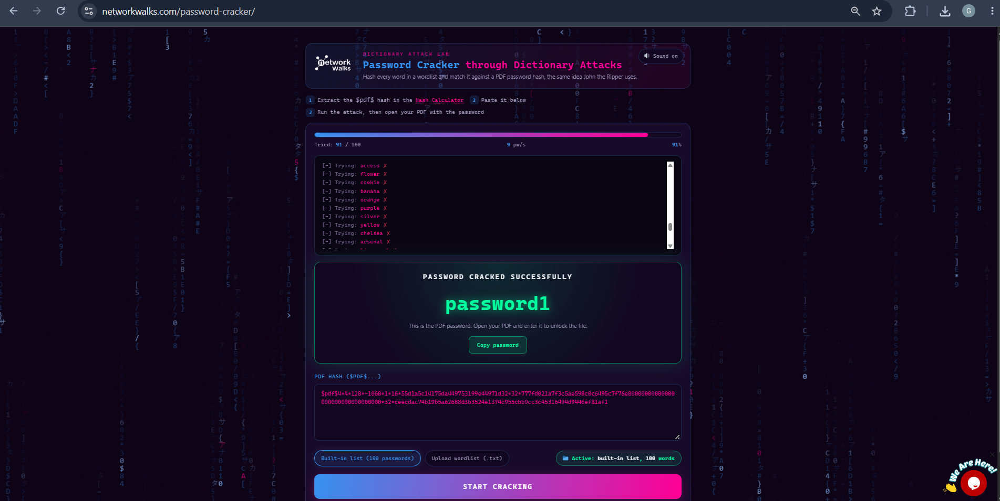
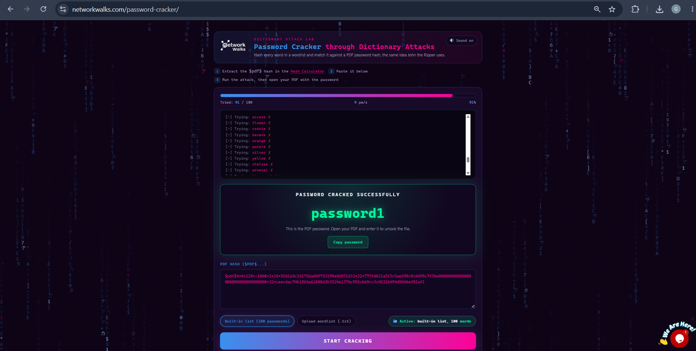

# 🛡️ Browser-Based Password Cracking & Hash Analysis with Networkwalks Tools – W3-PM2

## 📌 Executive Summary

As part of **Week 3 (W3-PM2)** of the Networkwalks Cybersecurity & Ethical Hacking Internship, I performed a practical exercise on password recovery of a password-protected PDF using the **Networkwalks Hash Calculator** and **Networkwalks Password Cracker**.

The objective was to extract the PDF password hash, perform a dictionary-based password attack, recover the password, verify it against the protected PDF, and capture the challenge flag.

> ⚠️ This activity was performed in an authorized cybersecurity training environment.

---

## 🎯 Objectives

- Extract the PDF password hash using the Networkwalks Hash Calculator.
- Understand the `$pdf$` hash format.
- Perform a dictionary-based password attack.
- Recover the PDF password using the Networkwalks Password Cracker.
- Verify the recovered password.
- Unlock the protected PDF.
- Capture the challenge flag.

---

## ⚙️ Target & Environment

| Category | Details |
|---|---|
| **Program** | Networkwalks Cybersecurity & Ethical Hacking Internship |
| **Batch** | B083-Networkwalks |
| **Week** | Week 3 |
| **Module** | W3-PM2 |
| **Target** | Password-Protected PDF |
| **Platform** | Windows |
| **Tools** | Networkwalks Hash Calculator, Networkwalks Password Cracker |
| **Verification** | Microsoft Edge / PDF Reader |
| **Environment** | Authorized Training / Lab Environment |

---

## 🧰 Tools Used

| Tool | Purpose |
|---|---|
| **Networkwalks Hash Calculator** | Extract PDF password hash |
| **Networkwalks Password Cracker** | Perform dictionary-based password recovery |
| **Microsoft Edge / PDF Reader** | Verify the recovered password |

---

# 🔬 Hands-on Technical Activities & Verification

## 🔹 Step 1: PDF Hash Extraction

The password-protected PDF was uploaded to the **Networkwalks Hash Calculator**.

The tool generated a crackable PDF hash in `$pdf$` format.

The extracted hash started with:

```text
$pdf$4*4*128*...
```

The hash extraction was completed successfully.

---

## 🔹 Step 2: Password Recovery

The extracted PDF hash was loaded into the **Networkwalks Password Cracker**.

A dictionary-based attack was performed using the built-in wordlist.

The correct password was identified at:

```text
Trial: 91 / 100
```

### Recovered Password

```text
password1
```

### Result

```text
✅ Password Cracked Successfully
```

---

## 🔹 Step 3: Password Verification

The recovered password was entered into the protected PDF:

```text
password1
```

The PDF successfully opened, confirming that the recovered password was correct.

```text
✅ Password Verified
✅ PDF Successfully Unlocked
```

---

## 🔹 Step 4: Flag Capture

After successfully unlocking the PDF, the challenge flag was obtained:

```text
nw{networkwalks_flag_jtr_270521_1}
```

### Final Status

```text
✅ Hash Extracted
✅ Password Cracked
✅ Password Verified
✅ PDF Unlocked
✅ Flag Captured
```

---

# 📊 Results

| Activity | Result |
|---|---|
| PDF Hash Extraction | ✅ Successful |
| `$pdf$` Hash Generated | ✅ Successful |
| Dictionary Attack | ✅ Successful |
| Recovered Password | `password1` |
| Cracking Progress | `91 / 100` |
| Password Verification | ✅ Successful |
| PDF Unlock | ✅ Successful |
| Flag Capture | ✅ Successful |

---

# 🧠 Key Learning

- PDF password hash extraction
- `$pdf$` hash format
- Dictionary-based password attacks
- Networkwalks Hash Calculator
- Networkwalks Password Cracker
- Password security
- Password verification
- Basic cryptographic concepts

---

# 🛡️ Security Recommendations

- Avoid common passwords such as `password1`.
- Use long and unique passwords or passphrases.
- Avoid predictable words and commonly used credentials.
- Use modern encryption mechanisms for sensitive documents.
- Restrict access to sensitive files.
- Avoid reusing passwords across different systems and documents.

---

# 📸 Evidence

## 1. PDF Hash Extraction

The protected PDF was uploaded to the Networkwalks Hash Calculator and the `$pdf$` hash was successfully extracted.



---

## 2. Password Successfully Cracked

The Networkwalks Password Cracker successfully identified the password at trial 91 of 100.

### Recovered Password

```text
password1
```



---

## 3. Password Verification

The recovered password was entered into the protected PDF and the document was successfully unlocked.



---

## 4. Challenge Flag Captured

The challenge flag was successfully obtained from the unlocked PDF.

```text
nw{networkwalks_flag_jtr_270521_1}
```


---

# 🎓 Learning Outcomes

Through this practical, I gained hands-on experience with:

- Extracting PDF password hashes
- Understanding `$pdf$` hash format
- Dictionary-based password recovery
- Networkwalks Hash Calculator
- Networkwalks Password Cracker
- Password verification
- PDF security
- Basic cryptographic analysis

---

# 👨‍💻 Internship Details

**Author:** Gopal Mahajan  
**Program:** Networkwalks Cybersecurity & Ethical Hacking Internship  
**Batch:** B083-Networkwalks  
**Week:** 3  
**Module:** W3-PM2  
**Project:** Browser-Based Password Cracking with Networkwalks Tools

---

# ⚠️ Ethical Disclaimer

This practical was performed only in an authorized cybersecurity training environment.

Password-cracking techniques should only be used against files, systems, accounts, or networks that you own or have explicit permission to test.

---

# 📁 Project Structure

```text
NETWORKWALKS-B083-WEEK3-PM2-PASSWORD-CRACKING-NWTOOLS/
│
├── README.md
├── 01-pdf-hash-extraction.png
├── 02-password-cracked.png
├── 03-password-verification.png
└── 04-flag-captured.png
```

---

# ✅ Final Result

```text
Target:
Password-Protected PDF

Recovered Password:
password1

Cracking Progress:
91 / 100

PDF Status:
Successfully Unlocked

Captured Flag:
nw{networkwalks_flag_jtr_270521_1}

Overall Status:
✅ PRACTICAL SUCCESSFULLY COMPLETED
```

---

## ⭐ Conclusion

This practical demonstrated PDF hash extraction and dictionary-based password recovery using the Networkwalks Hash Calculator and Networkwalks Password Cracker.

The recovered password was successfully verified by opening the protected PDF, and the challenge flag was captured successfully.

**🛡️ Hash Analysis | 🔐 Password Recovery | 🧪 Authorized Lab | ✅ Completed**
